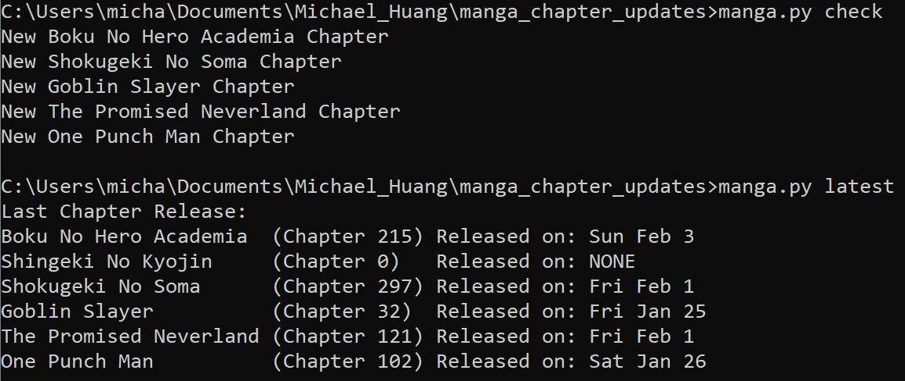

# Work Examples

Code examples from coursework and personal projects.

## manga_chapter_updates - Personal Project

Scrapes Manga Subreddits for new chapter updates. Stores latest chapter releases. Example usage of manga.py:



## java_examples - COMP 251 Algorithms and Data Structures Assignment

Three java files, balloon.java, mancala.java, and islands.java. Each takes a file as an input (testBalloons.txt, testMancala.txt, and testIslands.txt respectively) and performs different calculations and writes the answers to an output (testBalloons_solution.txt, testMancala_solution.txt, and testIslands_solution.txt respectively). Example usage below 

```
$ javac balloon.java
$ java balloon.java
```

## bmp_collage - COMP 206 Introduction to Software Systems Assignment

Code in A2_bmp_helpers.c. Takes two bmp files and creates a collage placing the second input on top of the first input with offsets starting from the bottom left. Example usage of output bmp_collage.exe:

```
.\bmp_collage img1.bmp img2.bmp output.bmp x_offset y_offset
```
